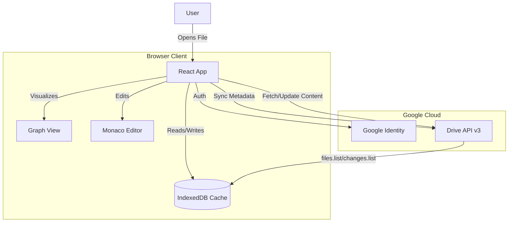

# System Overview: Gemini Knowledge Drive

## 1. Executive Summary
**Gemini Knowledge Drive (GKD)** is a high-performance, internal-only Single Page Application (SPA) designed to transform a Google Shared Drive of markdown files into a cohesive, interlinked knowledge base ("Obsidian for Drive"). 

It leverages the Google Drive API for storage and synchronization while providing a rich, local-first user experience with instant page loads, wiki-style linking, and bidirectional relationship visualization.

## 2. Core Philosophy
*   **"Drive is the Backend"**: No separate database. Truth lives in Drive.
*   **"Local is Fast"**: We cheat latency by mirroring metadata to the browser's IndexedDB.
*   **"Markdown is King"**: First-class support for GFM (GitHub Flavored Markdown), Frontmatter, and Wiki-links.

## 3. Tech Stack
| Layer | Technology | Justification |
| :--- | :--- | :--- |
| **Frontend Framework** | **React 19 + Vite** | Standard, performant, rich ecosystem. |
| **Language** | **TypeScript** | Mandatory for complex API data structures. |
| **State Management** | **Zustand** | Minimalist, avoids Redux boilerplate. |
| **Local Database** | **Dexie.js (IndexedDB)** | High-performance client-side storage for the file index. |
| **Styling** | **Tailwind CSS** | Rapid UI development, dark mode native. |
| **Markdown Engine** | **markdown-it** | Faster and more extensible than `marked`. |
| **Editor** | **Monaco Editor** | The VS Code editing experience users expect. |
| **Hosting** | **Firebase Hosting** | Free SSL, HTTP/2, native Google Auth integration. |

## 4. Architecture Diagram

## 5. Deployment Model
*   **Type**: Internal Google Workspace App.
*   **Access**: Restricted to specific Workspace Domain / User Group.
*   **Verification**: **Bypassed** (Internal-only apps do not require CASA/OAuth verification).
